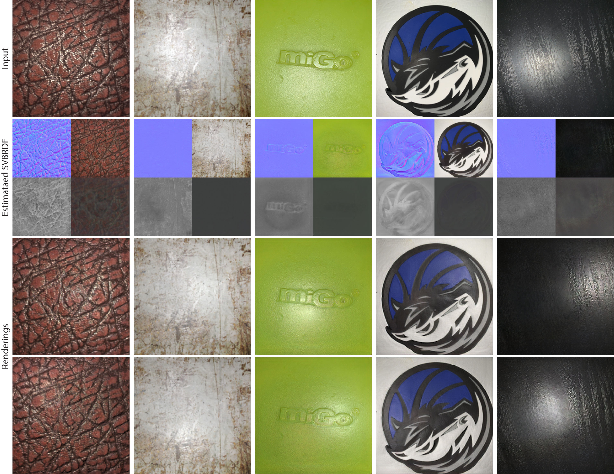

# Adversarial-Single-Image-SVBRDF-Estimation-with-Hybrid-Training

This is code of "Adversarial Single-Image SVBRDF Estimation with Hybrid Training" [Project](https://people.engr.tamu.edu/nimak/Papers/EG2021_SVBRDF/index.html) | [Paper](https://people.engr.tamu.edu/nimak/Data/EG21_SVBRDF.pdf)




## Requirements
This codebase was developed and tested with PyTorch 1.6 and Python 3.6 in both windows and Linux system.
To install environments, please use this command:

```bash
conda env create -f environment.yml
```


## Dataset 

The synthetic dataset are provided by Deschaintre et al. 2018, please download through this [link](https://repo-sam.inria.fr/fungraph/deep-materials/).
The real images dataset can be downloaded from this [link](https://drive.google.com/file/d/14c5LoyjDlg2x5MELbyEnH1XaDeitWQPX/view?usp=sharing).

The sturcture of real images folder looks like this:

``` 
folder:
	-- scene1:
		--img1
		--img2
		--img3
		...
	-- scene2
	-- scene3
	...
```

where img1, img2, img3 are the same scene lit under different light positions. The scenes are randomly shot under random environment.


## Inference

The pretrained checkpoint model can be downloaded from this [link](https://drive.google.com/file/d/1WUYpTb-wnX0b0025dlRCEQcXkK5W6nbO/view?usp=sharing).

To run the inference code, please use this command:

```
python test.py --name $exp --dataroot $data --resize_or_crop resize --MyTest ALL_4D --netG NewVA_Net_Light --which_epoch final --mode Real --savename $name
```

Please download the checkpoint and save it into `./checkpoints/$exp/`. `$data` is the path of test dataset. As default, the output results will be save into `./results/$exp/$name`. 

Here are some more instructions about the command arguments:

```
--name:			
		
	experiment name


--dataroot:	
			
	path of test dataset


--MyTest: ['ALL_4D','ALL_5D']
						
	ALL_4D: output four feature maps 

	ALL_5D: output four feature maps + rerendered images using estimated feature maps and light position given single input images


--which_epoch:			

	which checkpoint to load


--mode: ['Syn', 'Real']	
			
	Syn: save both ground truth and estimated results 

	Real: only save estimated results


--savename: 			

	the folder name where results are saved


--savelight_to_multi: 	

	save estimated light position into multiple .txt files (each file for each test image)


--savelight_to_one: 	

	save estimated light position into single .txt files (one file for all test images)

```


## Training

There are three steps required to train the model:


1. Train on synthetic images with four discriminators:
```
python train.py --dataroot $SynData --MyTest ALL_4D --name $name --niter $epoch --resize_or_crop crop --netG NewVA_Net --augment_input
```

Where `$SynData` is the path of synthetic dataset,`$epoch` is the training epochs. 


2. Train on synthetic images with five discriminators:

```
python train.py --dataroot $SynData --MyTest ALL_5D_Render --name $name --niter $epoch --resize_or_crop crop --netG NewVA_Net_Light --augment_input --continue_train --load_pretrain $loadckpt --which_epoch $load_epoch
```

Where `$loadckpt` is the path saving the checkpoint obtained in previous step (step 1), `$load_epoch` is the checkpoint we would like load.


3. Finetune network on real images:

```
python train.py --dataroot $SynData --MyTest ALL_5D_Render --name $name --niter $epoch --resize_or_crop crop --netG NewVA_Net_Light --augment_input --continue_train --which_epoch $epoch --load_pretrain $loadckpt --real_train --real_dataroot $RealData
```

Where `$loadckpt` is the path saving the checkpoint obtained in previous step (step 2), `$load_epoch` is the checkpoint we would like load, `$RealData` is the path of saved real images.


## Citation

If you find this work useful for your research, please cite:

```
@inproceedings{zhou2021adversarial,
  title={Adversarial Single-Image SVBRDF Estimation with Hybrid Training},
  author={Zhou, Xilong and Kalantari, Nima Khademi},
  booktitle={Computer Graphics Forum},
  volume={40},
  number={2},
  pages={315--325},
  year={2021},
  organization={Wiley Online Library}
}
```

## Contact

Please contact Xilong Zhou (1992zhouxilong@gmail.com) if there are any issues/comments/questions.

## License

Copyright (c) 2021, Xilong Zhou. 

All rights reserved.


